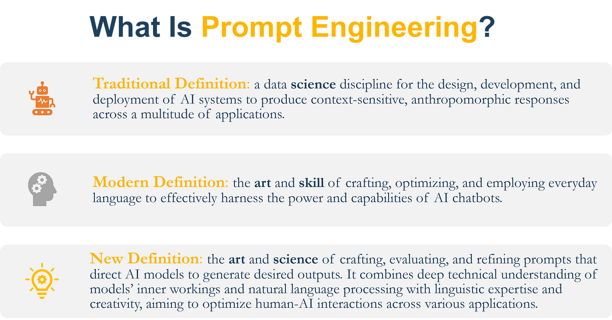
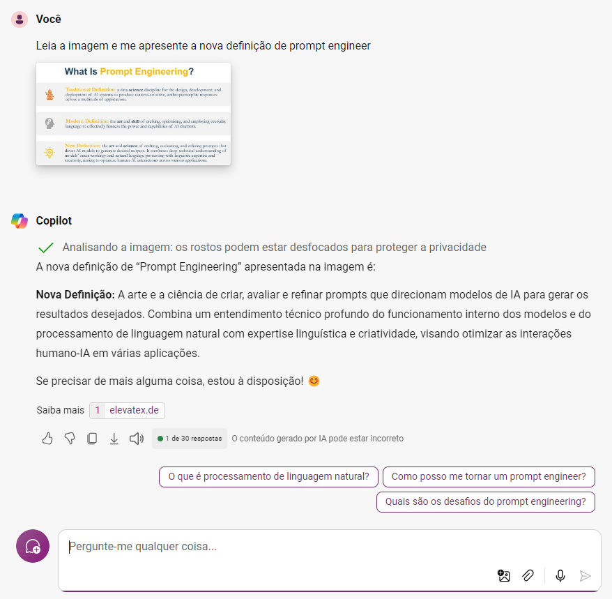
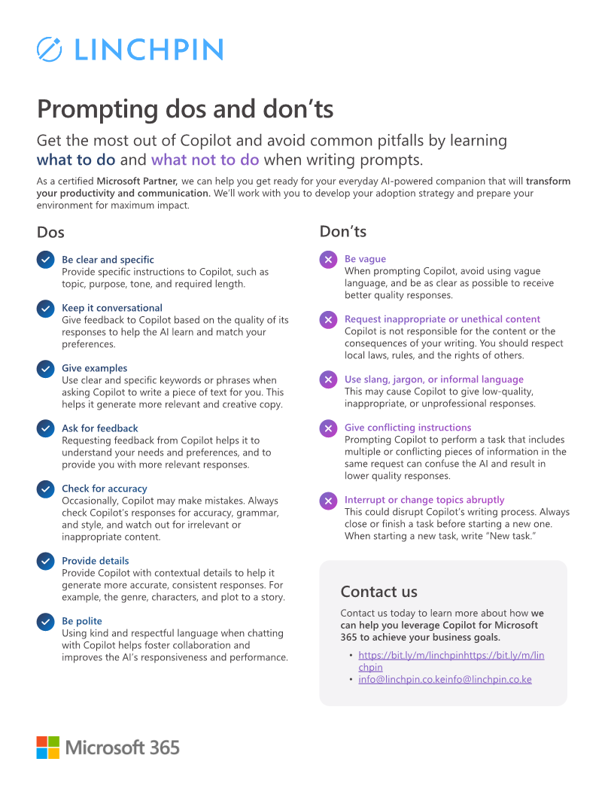
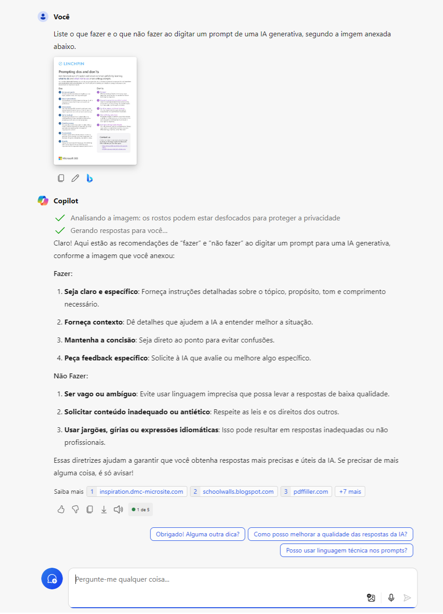

# Capacidade e utilização de IA Generativa

Ao longo dos últimos dias, talvez semanas, na verdade, apreciei um Bootcamp entitulado Microsoft Copilot AI, utilizando a plataforma da dio.me.

Neste Bootcamp, tive a oportunidade de aprender um pouco mais sobre as IA generativas e suas bases conceituais, perspectivas futuras e, não menos importante, questão éticas de sua utilização e respostas fornecidas.

Também, no Bootcamp foram apresentadas algumas soluções da Microsoft que integram IA, como no Office365, Bing, etc. Ainda, foi apresentado o Copilot Studio, uma ferramento que possibilita a criação de soluções personalizadas do Copilot.

Todas as trilhas evidenciam as capacidades da IA em auxiliar as pessoas em diversas tarefas, aprimorando sua produtividade e qualidade.

# Explorando a interpretação de imagens com o Copilot

Para verificar a capacidade de interpretação de uma IA Generativa, duas imagens foram selecionadas para que elas fossem analisadas pelo Copilot.

A primeira imagem é relacionada à definições de engenharia de prompt, a qual é apresentada abaixo.

Essa imagem foi carregado no Microsoft Copilot e a seguinte pergunta foi realizada:

"Leia a imagem e me apresente a nova definição de prompt engineer"

Posteriormente, a resposta obtida está anexada abaixo:

Já a segunda imagem utilizada para testar a capacidade do Copilot é relacionada com diretrizes de o que fazer e o que não fazer ao escrever um prompt de uma IA. A imagem utilizada é apresentada logo abaixo.

Após ao carregar a imagem, a pergunta "Liste o que fazer e o que não fazer ao digitar um prompt de uma IA Generativa, segundo a imagem anexada abaixo" foi direcionado ao Copilot. Após realizar suas análises, obteve-se a resposta da imagem abaixo.

Apesar de perguntas simples e diretas, é possível observar a capacidade de interpretação de imagem da IA e, também, em responder o questionamento com base no texto da imagem. Adicionalmente, observou-se a capacidade de tradução das informações, visto que ambas as imagens estava em língua inglesa, as perguntas estavam em português com palavras em inglês e a resposta foi totalmente em português com base na interpretação e tradução das informações das imagens.